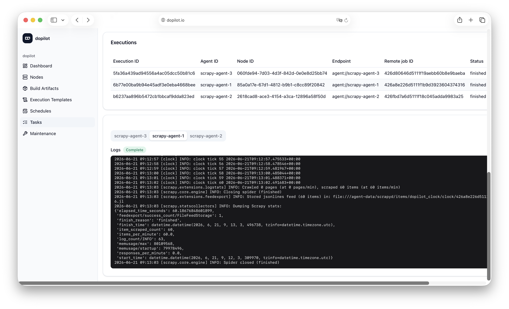

<p align="center">
  
</p>

<h1 align="center">dopilot</h1>

<p align="center">
  A self-hosted, single-admin scheduling platform for running Scrapy spiders and
  Python scripts across worker nodes.
</p>

<p align="center">
  <b>English</b> · <a href="README.zh-CN.md">简体中文</a>
</p>

<p align="center">
  
</p>

---

## What dopilot is

dopilot is a self-hosted platform that schedules and runs jobs on remote worker
nodes, streams their logs back in real time, and keeps a durable record of every
run. It is built greenfield as an `apps/` + `packages/` monorepo.

It is deliberately **single-admin**: there is no multi-user system or RBAC. It is
open source under the [MIT license](LICENSE). dopilot draws **behavioral**
inspiration from the upstream
[**scrapydweb**](https://github.com/my8100/scrapydweb) project (consulted
externally as a behavior reference); upstream scrapydweb code is never fetched,
vendored, imported, or built into dopilot.

### What it can run today

| Job type | Status | How it runs |
| --- | --- | --- |
| **Scrapy spiders** | Available | Upload a built `.egg`; the agent runs the spider on its in-process scrapyd. |
| **Python scripts** | Available | Upload a `.whl`; the agent runs a shell command with the wheel on `PYTHONPATH`. |
| **Docker long-running crawlers** | Planned | A future phase. Not implemented yet. |

## How it works

dopilot has two Docker roles, both built from one unified image
(`rabbir/dopilot:latest`); the runtime role is selected by the container command:

- **server**: the FastAPI hub. Serves the `/api/v1/*` JSON/SSE API and the
  bundled web UI, owns scheduling (APScheduler), persists business data and log
  indexes in **PostgreSQL**, and writes log bodies to files under
  `/server-data/logs`.
- **agent**: a worker. Consumes commands, runs jobs, and pushes status events and
  log increments back.

The server and agents talk over **Redis Streams** plus an agent heartbeat. Redis
is a transient message bus, not a database, and never the source of business
truth. The agent never connects to PostgreSQL directly.

```
 server ──XADD command──►  Redis Streams  ──consume──►  agent ──run──► scrapyd / python
   ▲                                                       │
   └────── status events · log increments · heartbeat ─────┘
```

Core domain model (snapshot is frozen at task creation):

```
BuildArtifact → ExecutionTemplate → Schedule → Task → Execution
```

A **Task** is one trigger; it fans out to one **Execution** per selected node,
chosen by the node strategy (`selected`, `all`, or `random`, filtered by node
capability and health).

### Python script execution model

A Python script is packaged as a `.whl` build artifact. On the agent, each wheel
is installed once per `sha256` with:

```bash
pip install --no-deps --target <agent-cache>/python_wheel/<sha256>/site <wheel>
```

The shell command then runs with that directory injected on `PYTHONPATH`:

```bash
PYTHONPATH=<site-dir>:$PYTHONPATH /bin/sh -c "<command>"
```

There is **no virtualenv**, no dependency resolution (`--no-deps`), and no
console-script entry point. Run importable modules, e.g. `python -m main`.
Dependencies the script needs beyond the wheel must already be present in the
agent environment.

## Quick deploy (Docker Compose)

The default compose stack pulls the CI-built `rabbir/dopilot` image — no local
build required. It brings up the full stack (PostgreSQL + Redis + one-shot
migrate + three Scrapy agents + server):

```bash
cd deploy/docker
cat > .env <<'EOF'
DOPILOT_ADMIN_PASSWORD=replace-with-admin-login-password
DOPILOT_ADMIN_API_TOKEN=replace-with-long-random-token
DOPILOT_AGENT_TOKEN=replace-with-long-random-agent-token
REDIS_PASSWORD=replace-with-redis-password
EOF
docker compose pull
docker compose up -d
```

The server is then reachable at **http://localhost:5000** (web UI and API). The
server runs single-replica only (in-process scheduler + in-memory SSE tables).
Override the image with `DOPILOT_IMAGE` (default `rabbir/dopilot:latest`).

For API clients, the simplest path is the static admin API token: present
`DOPILOT_ADMIN_API_TOKEN` directly as a Bearer token, no login round-trip:

```bash
curl -H "Authorization: Bearer $DOPILOT_ADMIN_API_TOKEN" \
  http://localhost:5000/api/v1/auth/me
```

Alternatively, log in with the single admin account and use the returned opaque
access token (signed by the internal `token_secret`):

```bash
ACCESS_TOKEN=$(
  curl -s http://localhost:5000/api/v1/auth/login \
    -H 'Content-Type: application/json' \
    -d '{"username":"admin","password":"'"$DOPILOT_ADMIN_PASSWORD"'"}' \
    | python3 -c 'import json,sys; print(json.load(sys.stdin)["access_token"])'
)

curl -H "Authorization: Bearer $ACCESS_TOKEN" \
  http://localhost:5000/api/v1/auth/me
```

`DOPILOT_ADMIN_API_TOKEN` is the externally supplied static admin API token
(must be >= 16 characters). It is **admin-only and server-side only**: it is
never sent to agents and is not a source for the machine token.
`DOPILOT_AGENT_TOKEN` is the agent machine token (must be >= 16 characters): the
agent presents it on outbound calls to the server (heartbeat + artifact/wheel
fetch), so the **same value** must be set on the server and every agent; leave it
unset to disable machine auth. The agent exposes no inbound HTTP API. The
login/stream signing key (`token_secret`) is a separate TOML-only value baked
into the image.

Token auth is not transport encryption. For encrypted cross-host traffic put the
server, agents, and Redis on a private network/VPN or terminate TLS at a reverse
proxy.

### Split deployment (server-only / agent-only)

To run the server on one host and join agents from elsewhere, use the split
compose files instead of the all-in-one one:

```bash
cd deploy/docker
# Server-only stack (db + redis + migrate + server, no agents). You may OMIT
# DOPILOT_AGENT_TOKEN — the server then generates and persists one under its data
# volume on first start (/server-data/secrets/agent-token).
docker compose -f docker-compose.server.yml up -d

# Read the (generated or configured) machine token to hand to your agents:
docker compose -f docker-compose.server.yml exec server dopilot-server agent-token print          # DOPILOT_AGENT_TOKEN=<token> + hint
docker compose -f docker-compose.server.yml exec server dopilot-server agent-token print --quiet  # bare token only

# On each agent host: join with that token (required, no dev fallback), the
# server's HTTP base URL, and the server's Redis. DOPILOT_SERVER_URL is an
# agent-side env var — the server HTTP base URL the agent uses for heartbeat and
# artifact/wheel fetch; it is REQUIRED here because the baked http://server:5000
# only resolves inside the all-in-one compose network (examples:
# http://<server-ip-or-dns>:5000,
# http://dopilot-server.dopilot.svc.cluster.local:5000,
# https://dopilot.example.com). Token auth is not transport encryption, so
# cross-host HTTP still needs a private network / VPN / TLS / reverse proxy.
# Agents never receive DOPILOT_ADMIN_API_TOKEN.
DOPILOT_AGENT_TOKEN=<token-from-server> DOPILOT_SERVER_URL=http://<server-host>:5000 \
  REDIS_PASSWORD=<server-redis-pass> REDIS_HOST=<server-host> \
  docker compose -f docker-compose.agent.yml up -d
```

The all-in-one `docker-compose.yml` keeps an explicit shared `DOPILOT_AGENT_TOKEN`
(server and agents start together, so generation cannot reach the agents). Token
auth is still not transport encryption — see the note above.

To build the image from local source instead of pulling, layer the build
override (used by the smoke scripts):

```bash
cd deploy/docker
docker compose -f docker-compose.yml -f docker-compose.build.yml up -d --build
```

> Compose configs keep web auth **on** and Redis password auth enabled. The
> default `change-me` fallbacks are dev-only; set the `.env` values above before
> exposing the server. Docker images already contain the default server/agent
> TOML files and the compose stack does not require `DOPILOT_CONFIG`.

## Local development

Prerequisites: Python **3.12**, Node **22+** with Corepack (`corepack pnpm …`),
and Docker (for PostgreSQL and Redis).

```bash
# 1. Python packages (protocol first; server/agent depend on it)
python3.12 -m venv .venv
source .venv/bin/activate
pip install -U pip wheel
pip install -e ./packages/protocol
pip install -e "./apps/server[dev]"
pip install -e "./apps/agent[dev]"

# 2. Backing services.
# Postgres can use the committed compose service; Redis needs a host port for
# host-run server/agent processes.
scripts/dev-db.sh up
docker run -d --rm --name dopilot-redis-dev -p 6379:6379 \
  redis:7 redis-server --appendonly yes

# 3. Apply migrations (server owns the schema)
(cd apps/server && DOPILOT_CONFIG=../../configs/server.example.toml alembic upgrade head)

# 4. Run the services (separate terminals).
# For the agent, copy configs/agent.example.toml to a local file and set:
#   [agent].server_url = "http://localhost:5000"
#   [redis].url = "redis://localhost:6379/0"
# The agent is outbound-only: it opens no inbound port (no -b/-p flags).
DOPILOT_CONFIG=configs/server.example.toml dopilot-server
DOPILOT_CONFIG=configs/agent.local.toml dopilot-agent

# 5. Web UI in dev mode (Next.js)
NEXT_PUBLIC_API_BASE=http://localhost:5000/api/v1 corepack pnpm --filter web dev
```

Stop the local Redis container with `docker stop dopilot-redis-dev`.

`DOPILOT_CONFIG` points local development processes at a TOML config under
`configs/`; `DOPILOT_DATABASE_URL` and `DOPILOT_REDIS_URL` override the database
and Redis URLs. Web admin auth is **fail-closed**: unless
`DOPILOT_AUTH_DISABLED=true` is set explicitly, `admin_username`,
`admin_password`, and `token_secret` must all be configured. Server-agent
machine auth uses the single `DOPILOT_AGENT_TOKEN` (the same value on the server
and every agent); leave it unset to disable machine auth. The admin API token is
never used as the machine token.

The web app is a **Next.js static export** (shadcn/ui + react-i18next) served by
`dopilot-server` from the same container; there is no separate web container and
no Node production runtime.

## Tests & lint

```bash
pytest                             # pytest (server/agent/protocol)
corepack pnpm --filter web test    # web vitest
corepack pnpm --filter web build   # static export build
ruff check apps packages           # lint
cd deploy/docker && docker compose config
```

## Documentation

Goals, decisions, and the phased roadmap live under [`docs/`](docs/README.md):

- [`docs/dopilot/00-requirements.md`](docs/dopilot/00-requirements.md): the
  north-star: product goals, confirmed decisions, the phased roadmap.
- [`docs/dopilot/10-roadmap.md`](docs/dopilot/10-roadmap.md): the consolidated
  build/port roadmap.
- [`CLAUDE.md`](CLAUDE.md): architecture, hard constraints, current status.

## Contributing

See [`CONTRIBUTING.md`](CONTRIBUTING.md) for setup and verification commands, and
[`SECURITY.md`](SECURITY.md) for vulnerability reporting and operator hardening
(replace the default `change-me` secrets before exposing a deployment).

## License

dopilot is released under the [MIT License](LICENSE)
(SPDX-License-Identifier: `MIT`).
